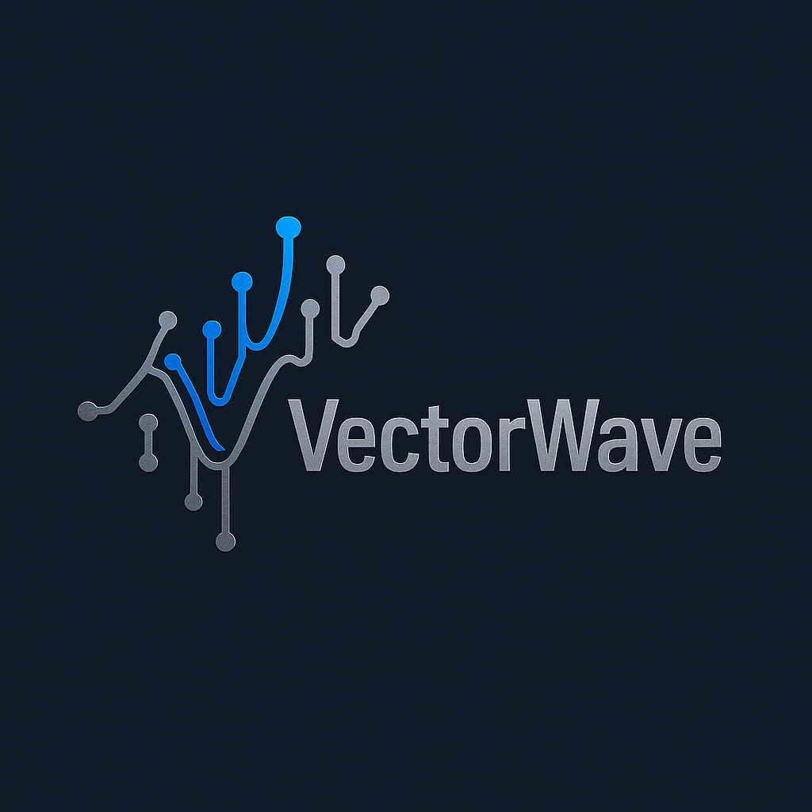

|  |
|:--:|
|  |

[](https://openjdk.org/projects/jdk/21/)
[](https://maven.apache.org/)
[](https://www.gnu.org/licenses/gpl-3.0)
[](https://github.com/MorphIQ-Labs/VectorWave/actions/workflows/ci.yml)
[](https://morphiq-labs.github.io/VectorWave/)
[](docs/SIMD_INTEGRATION.md)
[](https://morphiq-labs.github.io/VectorWave/coverage/core/index.html)

High-performance wavelet transform library for Java 21+ featuring MODWT (Maximal Overlap Discrete Wavelet Transform) as the primary transform. Offers shift-invariance, arbitrary signal length support, and comprehensive wavelet families for financial analysis, signal processing, and real-time applications.

Note on SIMD acceleration
- SIMD/Vector API acceleration lives in the optional `vectorwave-extensions` module (Java 24 + incubator API). The core module remains a portable scalar Java 21 implementation. Add the extensions dependency to enable SIMD paths and batch facades.

Project stance
- Core = Java 21 scalar library. SIMD and structured parallel transforms are provided in the extensions module.

### CWT Experimental Status

- CWT APIs are experimental and may change in minor releases. Public types are annotated with `@Experimental` and the `com.morphiqlabs.wavelet.cwt` package Javadoc carries an experimental banner. For production use, pin to an exact VectorWave version and prefer the stable MODWT/SWT APIs for critical paths.

Scaling and Boundary Semantics
- MODWT/SWT scaling: per-stage 1/√2 with à trous upsampling (insert 2^(j−1)−1 zeros), composing to the textbook 2^(−j/2) at level j.
- Boundary modes: `PERIODIC` yields exact reconstruction; `ZERO_PADDING` is linear convolution with edge attenuation; `SYMMETRIC` mirrors boundaries and uses simple level/family heuristics tuned for low RMSE.
  See the Boundary Modes Matrix below for a concise comparison.

Javadocs & Coverage
- Core API Javadocs include concise examples and behavior notes. Generate locally:
  - Core: `mvn -q -DskipTests -pl vectorwave-core javadoc:javadoc`
  - Extensions (Java 24 preview): `mvn -q -DskipTests -pl vectorwave-extensions javadoc:javadoc`
  - In CI, Javadocs run with doclint enabled; see workflow `javadoc-checks`.
- Hosted: https://morphiq-labs.github.io/VectorWave/ (updates on pushes to `main`)
- Changelog: see [CHANGELOG.md](CHANGELOG.md) for release notes
 - Release notes: see [docs/RELEASE_NOTES.md](docs/RELEASE_NOTES.md)
- Core coverage (JaCoCo) is published to GitHub Pages: https://morphiq-labs.github.io/VectorWave/coverage/core/index.html

## Project Structure

VectorWave is organized as a modular Maven project:

- **vectorwave-fft**: Standalone FFT utilities (CoreFFT), used by core
- **vectorwave-core**: Core wavelet transforms, algorithms, and base functionality (Java 21)
- **vectorwave-extensions**: SIMD optimizations, performance enhancements, and platform-specific code (Java 24 + preview)
- **vectorwave-examples**: Demos and usage examples (no JMH)
- **vectorwave-benchmarks**: Non‑modular JMH benchmarks (classpath)

## Features

### Core Capabilities (Core module)
- **MODWT**: Shift-invariant transform for ANY signal length
- **SWT Adapter**: Stationary Wavelet Transform interface with mutable coefficients
- **Wavelet Families**: Haar, Daubechies, Symlets, Coiflets, Biorthogonal, Financial wavelets
- **CWT (Experimental)**: FFT-accelerated continuous transforms with complex analysis
- Portable scalar implementation (SIMD is available via the optional extensions module)
- **Financial Analysis**: Specialized wavelets and configurable parameters
- **Streaming**: Real-time processing with arbitrary block sizes
- **Zero Dependencies**: Pure Java implementation

### Performance (with extensions)
- **SIMD Acceleration (Extensions)**: Platform-adaptive Vector API (x86: AVX2/AVX512, ARM: NEON)
  - 2-4x speedup on MODWT transforms
  - 3-5x speedup on batch processing
  - Automatic fallback to optimized scalar code
- **Structured Concurrency**: Automatic resource management with guaranteed cleanup
- **Adaptive Thresholding**: Machine learning optimization of parallel execution
- **FFT Optimization**: Real-to-complex FFT with 2x speedup for real signals
- **Core FFT Optimizations**: Unified `CoreFFT` (in `vectorwave-fft`) with opt-in Stockham autosort kernel and real-optimized RFFT; optional global twiddle cache for common sizes. See `docs/performance/CORE_FFT_OPTIMIZATIONS.md` and configuration flags in `docs/CONFIGURATION.md`.
- **Batch Processing**: SIMD parallel processing of multiple signals
  - 16 signals (4K samples): 4.3x speedup vs sequential
  - Near-linear scaling up to 8 cores
- **Memory Efficiency**: 24 bytes/sample with object pooling
- **Benchmark Results**: [Detailed performance data](docs/BENCHMARK-RESULTS.md)

### Key Applications
- **Financial Analysis**: Crash detection, volatility analysis, regime identification
- **Signal Processing**: Denoising, time-frequency analysis, feature extraction
- **Real-time Systems**: Streaming transforms with microsecond latency
- **Scientific Computing**: Multi-level decomposition and reconstruction

## Requirements

- Java 21+ for core module; Java 24 (preview) for extensions (GraalVM 24.0.2 recommended)
- Maven 3.6+
- Core: no preview flags required
- Extensions/examples: compile/run with `--add-modules jdk.incubator.vector --enable-preview`
- Structured concurrency (extensions): requires `--enable-preview`

### Boundary Modes Matrix

| Mode        | Typical Use Cases                          | Reconstruction Behavior                      |
|-------------|--------------------------------------------|----------------------------------------------|
| PERIODIC    | Benchmarks, exactness, synthetic signals   | Exact reconstruction for MODWT/SWT            |
| ZERO_PADDING| Streaming blocks, sparse edges, attenuation| Approximate near edges; interior accurate     |
| SYMMETRIC   | Natural signals, smooth edges, denoising   | Heuristic inverse alignment; interior accurate|

Notes:
- SYMMETRIC uses a small, wavelet/level‑dependent alignment heuristic (±τj). Prefer asserting interior‑region equality; use PERIODIC when exactness is required. See docs/guides/SYMMETRIC_ALIGNMENT.md.

### Level Interpretation (Quick Guide)

- Level 1: Finest details (high-frequency transients, noise).
- Levels 2–3: Mid-frequency structure (edges, short cycles).
- Levels 4+: Coarser trends (slow regimes, long cycles). Bandwidth varies by family (DB4 vs DB6 vs COIF).

See docs/guides/LEVEL_INTERPRETATION.md for DB4/DB6/COIF examples.
- Vector API optional (automatic scalar fallback)
- **Recommended**: GraalVM 24.0.2 for 10-20% additional performance

## Quick Start

### Building from Source

```bash
# Clone the repository
git clone https://github.com/MorphIQ-Labs/VectorWave.git
cd VectorWave

# Build all modules
mvn clean install

# Run tests with Vector API enabled
mvn test -Dtest.args="--add-modules jdk.incubator.vector --enable-preview"

# Run interactive demos
cd vectorwave-examples
mvn exec:java -Dexec.mainClass="com.morphiqlabs.Main"
```

### Maven Dependency

```xml
<dependency>
    <groupId>com.morphiqlabs</groupId>
    <artifactId>vectorwave-core</artifactId>
    <version>1.0.0</version>
</dependency>

<!-- For SIMD optimizations (optional) -->
<dependency>
    <groupId>com.morphiqlabs</groupId>
    <artifactId>vectorwave-extensions</artifactId>
    <version>1.0.0</version>
</dependency>
```

### Basic Usage

```java
import com.morphiqlabs.wavelet.modwt.MODWTTransform;
import com.morphiqlabs.wavelet.modwt.MODWTResult;
import com.morphiqlabs.wavelet.wavelets.Haar;
import com.morphiqlabs.wavelet.BoundaryMode;

MODWTTransform transform = new MODWTTransform(new Haar(), BoundaryMode.PERIODIC);
double[] signal = {1, 2, 3, 4, 5, 6, 7}; // Any length!
MODWTResult result = transform.forward(signal);
double[] reconstructed = transform.inverse(result);
```

### Boundary Modes

- PERIODIC: Circular convolution; numerically exact reconstruction for MODWT and recommended for benchmarking.
- ZERO_PADDING: Linear convolution with implicit zeros; expect boundary effects (use relaxed error tolerances near edges).
- SYMMETRIC: Mirrored extension with level-aware alignment (plus/minus orientation and small τj deltas) guided by our documented strategy; see `docs/guides/SYMMETRIC_ALIGNMENT.md`. Use PERIODIC when strict exactness is required.

## Key Examples

### 1. Basic MODWT Transform
```java
// Works with ANY signal length - no power-of-2 restriction!
MODWTTransform transform = new MODWTTransform(Daubechies.DB4, BoundaryMode.PERIODIC);
double[] signal = new double[777]; // Any length
MODWTResult result = transform.forward(signal);
double[] reconstructed = transform.inverse(result); // Perfect reconstruction
```

### 2. High-Performance Batch Processing (Extensions)
```java
// SIMD batch MODWT via extensions facade (AoS inputs, SoA under the hood)
double[][] signals = new double[32][1000]; // 32 signals of equal length
// Single-level
var single = com.morphiqlabs.wavelet.modwt.BatchMODWT.singleLevelAoS(
    com.morphiqlabs.wavelet.api.Daubechies.DB4, signals);
double[][] approx = single.approx();
double[][] detail = single.detail();
double[][] recon1 = com.morphiqlabs.wavelet.modwt.BatchMODWT.inverseSingleLevelAoS(
    com.morphiqlabs.wavelet.api.Daubechies.DB4, approx, detail);

// Multi-level
int levels = 3;
var multi = com.morphiqlabs.wavelet.modwt.BatchMODWT.multiLevelAoS(
    com.morphiqlabs.wavelet.api.Daubechies.DB4, signals, levels);
double[][][] detailPerLevel = multi.detailPerLevel();
double[][] finalApprox = multi.finalApprox();
double[][] reconN = com.morphiqlabs.wavelet.modwt.BatchMODWT.inverseMultiLevelAoS(
    com.morphiqlabs.wavelet.api.Daubechies.DB4, detailPerLevel, finalApprox);
```

### 3. Financial Analysis
```java
// Configure financial analysis parameters
FinancialConfig config = new FinancialConfig(0.045); // 4.5% risk-free rate
FinancialWaveletAnalyzer analyzer = new FinancialWaveletAnalyzer(config);

// Wavelet-based Sharpe ratio calculation
double sharpeRatio = analyzer.calculateWaveletSharpeRatio(returns);

// Crash asymmetry detection using Paul wavelet
PaulWavelet paulWavelet = new PaulWavelet(4);
CWTTransform cwt = new CWTTransform(paulWavelet);
CWTResult crashAnalysis = cwt.analyze(priceReturns, scales);
```

### 4. Real-time Streaming
```java
// Streaming denoiser with arbitrary block sizes
MODWTStreamingDenoiser denoiser = new MODWTStreamingDenoiser.Builder()
    .wavelet(Daubechies.DB4)
    .bufferSize(480) // 10ms at 48kHz - no padding needed!
    .thresholdMethod(ThresholdMethod.UNIVERSAL)
    .build();

// Process continuous stream
for (double[] chunk : audioStream) {
    double[] denoised = denoiser.denoise(chunk);
}
```

### 8. Batch Streaming (Extensions)
```java
// Process AoS chunks for a batch of signals using SIMD under the hood
try (var streaming = new com.morphiqlabs.wavelet.modwt.BatchStreamingMODWT.Builder()
         .wavelet(com.morphiqlabs.wavelet.api.Daubechies.DB4)
         .boundary(com.morphiqlabs.wavelet.api.BoundaryMode.PERIODIC) // fastest (SIMD). ZERO_PADDING/SYMMETRIC also supported
         .levels(3) // multi-level per-chunk
         .build()) {
  for (double[][] chunk : chunkedBatch) { // chunk: [batch][blockSize]
    var result = streaming.processMultiLevel(chunk);
    double[][][] dpl = result.detailPerLevel();
    double[][] approx = result.finalApprox();
    // ...consume outputs...
  }
}
```
More in: `docs/guides/BATCH_STREAMING.md`.

### 5. SWT (Stationary Wavelet Transform)
```java
// SWT adapter for shift-invariant denoising and analysis
try (VectorWaveSwtAdapter swt = new VectorWaveSwtAdapter(Daubechies.DB4, BoundaryMode.PERIODIC)) {
  // Decompose with mutable coefficients for custom processing
  MutableMultiLevelMODWTResult result = swt.forward(signal, 4);

  // Apply universal threshold for denoising
  swt.applyUniversalThreshold(result, true); // soft thresholding

  // Or use convenience denoising method
  double[] denoised = swt.denoise(noisySignal, 4, -1, true); // auto threshold

  // Extract specific frequency bands
  double[] highFreq = swt.extractLevel(signal, 4, 1); // finest details
}
```

### 6. Structured Concurrency (Extensions, Java 24 Preview)
```java
// Automatic resource management with guaranteed cleanup
try (var executor = new StructuredExecutor()) {
    // Submit multiple tasks with automatic cancellation propagation
    List<Future<MODWTResult>> futures = executor.submitAll(
        List.of(signal1, signal2, signal3),
        signal -> transform.forward(signal)
    );
    
    executor.joinAll(); // Wait for all tasks to complete
    
    // Collect results - all tasks complete or none do
    List<MODWTResult> results = new ArrayList<>();
    for (var future : futures) {
        results.add(future.get());
    }
} // Automatic cleanup - all tasks cancelled if scope exits early

// Parallel batch processing with timeout
ParallelConfig config = ParallelConfig.builder()
    .targetCores(4)
    .minParallelThreshold(256)
    .build();

StructuredParallelTransform parallelTransform = new StructuredParallelTransform(
    Daubechies.DB4, BoundaryMode.PERIODIC, config);

// Process with timeout - throws ComputationException if exceeded
double[][] signals = generateLargeDataset();
MODWTResult[] results = parallelTransform.forwardBatchWithTimeout(signals, 5000); // 5s timeout
```

### 7. Performance Monitoring
```java
// Check platform capabilities
WaveletOperations.PerformanceInfo info = WaveletOperations.getPerformanceInfo();
System.out.println(info.description());
// Output: "Vectorized operations enabled on aarch64 with S_128_BIT"

// Estimate processing time
MODWTTransform.ProcessingEstimate estimate = transform.estimateProcessingTime(signalLength);
System.out.println(estimate.description());
```

## Wavelet Selection Guide

| Wavelet | Best For | Key Properties |
|---------|----------|----------------|
| **Haar** | Fast processing, edge detection | Simplest, compact support |
| **Daubechies** | General purpose, compression | Orthogonal, good frequency localization |
| **Paul** | Financial crash detection | Asymmetric, captures sharp rises/falls |
| **Morlet** | Time-frequency analysis | Complex, good time-frequency balance |
| **Mexican Hat** | Edge detection, volatility | Second derivative of Gaussian |
| **Shannon-Gabor** | Spectral analysis | Reduced artifacts vs classical Shannon |

## Performance Highlights

Based on extensive benchmarking with GraalVM 24.0.2 on modern hardware:

| Operation | Signal Size | Time (Core) | Time (Extensions) | Speedup |
|-----------|------------|-------------|-------------------|---------|
| MODWT Forward | 16K samples | 1.62ms | 0.47ms | **3.5x** |
| MODWT Round-trip | 16K samples | 2.84ms | 0.76ms | **3.7x** |
| Batch (16 signals) | 4K each | 5.73ms | 0.98ms | **5.8x** |
| 5-Level Decomposition | 16K samples | 8.12ms | 2.32ms | **3.5x** |
| Denoising | 16K samples | 14.26ms | 3.68ms | **3.9x** |

**Key Performance Metrics (with GraalVM):**
- Throughput: 35M+ samples/second with SIMD
- Latency: Sub-millisecond for 4K signals  
- Memory: 24 bytes per sample overhead
- Scaling: Near-linear up to 8 cores
- GraalVM Boost: Additional 10-20% over OpenJDK

See [detailed benchmarks](docs/BENCHMARK-RESULTS.md) and [GraalVM optimization guide](docs/GRAALVM-OPTIMIZATION-GUIDE.md).

## Documentation

### Core Documentation
- [API Reference](docs/API.md) - Complete API documentation  
- [Architecture Overview](docs/ARCHITECTURE.md) - System design and module structure
- [Configuration Guide](docs/CONFIGURATION.md) - Configuration options and parameters

### User Guides
- [Developer Guide](docs/guides/DEVELOPER_GUIDE.md) - Getting started with development
- [Wavelet Selection Guide](docs/WAVELET_SELECTION.md) - Choosing the right wavelet
- [SWT Guide](docs/guides/SWT.md) - Stationary Wavelet Transform usage
- [Denoising Guide](docs/guides/DENOISING.md) - Signal denoising techniques
- [Financial Analysis Guide](docs/guides/FINANCIAL_ANALYSIS.md) - Market analysis applications
- [Streaming Guide](docs/guides/STREAMING.md) - Real-time signal processing
- [Batch Processing Guide](docs/guides/BATCH_PROCESSING.md) - SIMD optimization for bulk operations

### Performance
- [Performance Guide](docs/PERFORMANCE.md) - Performance characteristics and tuning
- [SIMD Integration](docs/SIMD_INTEGRATION.md) - Enabling and using Vector API (extensions)
- [Benchmark Results](docs/BENCHMARK-RESULTS.md) - Detailed benchmark data
- [GraalVM Optimization](docs/GRAALVM-OPTIMIZATION-GUIDE.md) - GraalVM-specific optimizations
- [Performance Tuning](docs/guides/PERFORMANCE_TUNING.md) - Advanced performance optimization

### Technical Specifications
- [Transform Compatibility](docs/TRANSFORM_COMPATIBILITY.md) - Transform comparison and compatibility
- [Wavelet Registry Best Practices](docs/WAVELET_REGISTRY-BEST_PRACTICES.md) - Using the wavelet registry
- [SWT Best Practices](docs/SWT_BEST_PRACTICES.md) - Best practices for SWT usage
- [Financial Wavelets](docs/FINANCIAL_WAVELETS.md) - Specialized wavelets for finance

### Development
- [Adding New Wavelets](docs/development/ADDING_WAVELETS.md) - Extending wavelet families
- [Benchmarking Guide](docs/development/BENCHMARKING.md) - Running and creating benchmarks
- [Examples Guide](docs/development/EXAMPLES.md) - Creating demo applications
- [Wavelet Provider SPI](docs/development/WAVELET_PROVIDER_SPI.md) - Service provider interface

## Demos and Examples

Run interactive demos from the vectorwave-examples module:

```bash
cd vectorwave-examples

# Interactive menu with all demos
mvn exec:java -Dexec.mainClass="com.morphiqlabs.Main"

# Specific demos
mvn exec:java -Dexec.mainClass="com.morphiqlabs.demo.MODWTDemo"
mvn exec:java -Dexec.mainClass="com.morphiqlabs.demo.FinancialDemo"
mvn exec:java -Dexec.mainClass="com.morphiqlabs.demo.LiveTradingSimulation"
mvn exec:java -Dexec.mainClass="com.morphiqlabs.demo.StreamingDenoiserDemo"
mvn exec:java -Dexec.mainClass="com.morphiqlabs.demo.BatchProcessingDemo"
mvn exec:java -Dexec.mainClass="com.morphiqlabs.demo.SWTDemo"

# Run benchmarks
mvn -q -pl vectorwave-benchmarks -am exec:java -Dexec.mainClass="org.openjdk.jmh.Main" -Dexec.args="com.morphiqlabs.benchmark.MODWTBenchmark"
```

**Available Demos**:
- `MODWTDemo` - Basic MODWT transforms and reconstruction
- `FinancialDemo` - Financial analysis with specialized wavelets
- `StreamingDenoiserDemo` - Real-time signal denoising
- `BatchProcessingDemo` - SIMD-accelerated batch processing
- `SWTDemo` - Stationary Wavelet Transform operations
- `LiveTradingSimulation` - Simulated trading with wavelet analysis

## Contributing

Contributions are welcome! Please read the [Developer Guide](docs/guides/DEVELOPER_GUIDE.md) and the short [Contributing Guidelines](docs/CONTRIBUTING.md). Ensure:

1. All tests pass: `mvn test`
2. Code follows existing patterns and conventions
3. We take a test‑driven approach: add or update tests alongside every change
4. Documentation is updated for API changes

## Support

- **Issues**: [GitHub Issues](https://github.com/MorphIQ-Labs/VectorWave/issues)
- **Discussions**: [GitHub Discussions](https://github.com/MorphIQ-Labs/VectorWave/discussions)
- **Documentation**: [Full Documentation](docs/README.md)

## License

GPL-3.0 - See [LICENSE](LICENSE) file for details.

## Citation

If you use VectorWave in your research, please cite:

```bibtex
@software{vectorwave2025,
  title = {VectorWave: High-Performance Wavelet Transform Library for Java},
  year = {2025},
  url = {https://github.com/MorphIQ-Labs/VectorWave}
}
```
### 7. Logging

VectorWave uses JDK `System.Logger` for internal diagnostics (zero external deps). Configure levels via `-Dvectorwave.log.level=...` or JUL’s `logging.properties`. See `docs/CONFIGURATION.md#logging` for examples (including JUL setup and Maven Surefire configuration).
